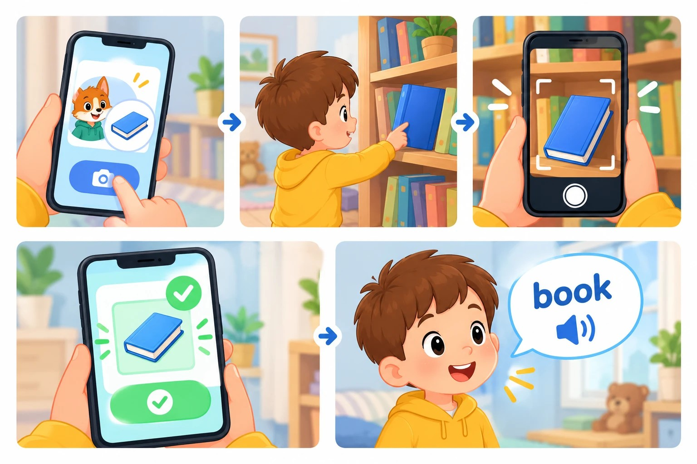
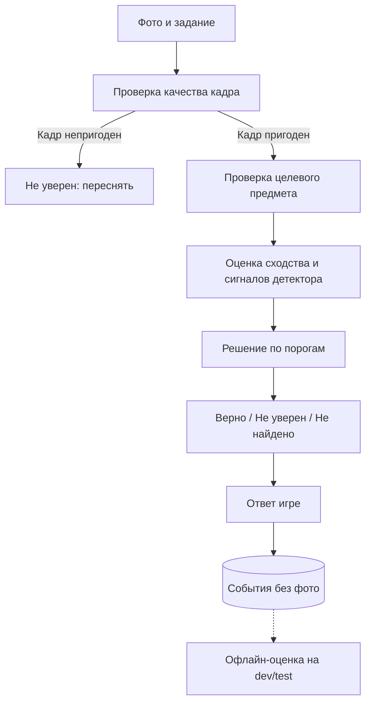

# ML System Design Doc — «Английский вокруг нас»: игра с проверкой по фото для детей 2–7 лет

**Автор:** Плехов Родион Константинович, ИТМО · **Версия:** 1.8 · **Дата:** 2026-11-28

## 1. Цели и предпосылки

### 1.1. Зачем идём в разработку продукта?

Дошкольники знакомятся с английскими словами по карточкам и картинкам, без связи с предметами вокруг, и интерес быстро пропадает. Игра устроена так: персонаж по-русски просит найти дома предмет или цвет, ребёнок фотографирует находку, игра проверяет фото, и тогда звучит английское слово. Метод опирается на обучение через действие (Total Physical Response).

**Цель:** вовлечь ребёнка и связать английское слово с настоящим предметом, который он нашёл сам.

| Цепочка эффекта | |
|---|---|
| Проблема | Слова без контекста, интерес быстро пропадает |
| Решение | Игра: задание, поиск, фото, проверка, английское слово |
| Действие | Игра засчитывает находку или просит попробовать ещё |
| Эффект | Больше слов услышано в связке с настоящим предметом |
| Деньги | Не рассматриваются: ценность определяется вовлечением, которое ещё нужно измерить |

**Нужен ли ML.** Без проверки засчитывалось бы любое фото, и смысл «слово связано с предметом» пропадает. Проверка требует понимать изображение, правилом её не заменить. Английское слово и озвучка модели не требуют.

**Какие подходы к проверке сравниваются.** Компактные детекторы YOLOv8n и YOLO11n сравниваются с MobileCLIP-S0, который сопоставляет фото с текстом. В ДЗ №2 выполнено офлайн-сравнение на всех 5 000 изображениях COCO val2017 по 26 классам. Результат используется для выбора кандидата на PoC. Качество на фотографиях из игры будет проверено на отдельном целевом наборе.

**Успех итерации:** модель редко принимает чужой предмет и редко отклоняет правильный. В ДЗ №2 это выражено так: FAR не выше 5% по каждому из 26 классов при консервативном пороге, а recall кандидата не ниже baseline (YOLOv8n — 87,6% в среднем по классам). Продуктовые пределы FAR, recall и доли ответов «не уверен» для целевого test фиксируются после замеров на dev, до открытия test.

В ДЗ №3 скоуп сужен до 10 домашних классов первого PoC. На них baseline YOLOv8n даёт recall 83,0% при том же протоколе, поэтому критерий «не ниже baseline» сравнивается с 83,0%, а не с 87,6% по 26 классам.

### 1.2. Бизнес-требования и ограничения

**Процесс игры:** ребёнок получает задание, находит предмет дома, фотографирует его, игра проверяет фото, и звучит английское слово.

| № | Требование |
|---|---|
| БТ-1 | Задание по-русски: текст, картинка, озвучка |
| БТ-2 | Съёмка камерой устройства без установки приложения |
| БТ-3 | Проверка, что на фото нужный предмет или цвет |
| БТ-4 | Понятный ребёнку ответ |
| БТ-5 | После верного фото звучит английское слово |

**Ограничения.**
- Фото детей остаются на устройстве и не сохраняются. До пилота нужна юридическая и privacy-проверка по 152-ФЗ.
- Для домашнего MVP взрослый выбирает задания из безопасных предметов, доступных в квартире. Предварительный исследовательский каталог включает также уличные объекты. Автобус, поезд и другие такие классы используются в сравнении на COCO, а домашний каталог утверждается отдельно.
- Задания только из утверждённого безопасного списка.
- Лицензии моделей и данных проверяются по каждому источнику, ведётся реестр; для датасетов с лицензиями на отдельные изображения условия проверяются по каждому файлу.

**Ожидания от итерации.** К концу ДЗ №2 должны быть получены EDA предварительного каталога, воспроизводимое сравнение моделей и кандидат для PoC. В эксперименте используется ориентир FAR 5%. Продуктовый предел ложных подтверждений и правила трёх ответов будут согласованы до целевого теста. Критерии завершения текущей работы приведены в результатах этапов 1 и 2.

**Бизнес-процесс пилота.** Игру проверяют на реальных пользователях: дети с родителями. Проведение пилота вне этой итерации, его дизайн и критерии успеха описаны в разделе 3.

**Что считается успешным результатом.** Модели сопоставлены на одинаковых фото и классах, а выбор кандидата объяснён через AP, recall, FAR и трудные задания. Наблюдаемые результаты по каждому классу доступны для проверки. Следующий шаг связывает этот результат с домашним сценарием через целевые dev/test и интеграцию в игру.

### 1.3. Скоуп итерации

В ДЗ №2 исследуется часть БТ-3, связанная с наличием предмета на фото. Рассмотрены 58 заданий предварительного каталога. Для 38 нашлась подходящая категория COCO, после фильтра с минимум 100 положительными фотографиями осталось 26 классов. На них сравнены три предобученные модели и выбран кандидат для PoC.

В ДЗ №3 работа сужена до 10 домашних классов (bottle, cell phone, backpack, clock, vase, potted plant, laptop, keyboard, tv, banana). На них обучены и оценены baseline и основная модель: детектор дообучен на COCO train2017 и Open Images V7 train с трудными негативами, оценка выполнена на COCO val2017 и Open Images V7 test. Целевые домашние фото не собирались, поэтому открытые наборы служат прокси для dev и test. Для пилота описаны дизайн, критерии успеха и подготовительные шаги (раздел 3).

БТ-1, БТ-2, БТ-4 и БТ-5 описывают будущую интеграцию игрового сценария. Проверка цвета, качества кадра и трёх исходов решения запланирована в этапе 3. Реализация интерфейса, работа на мобильном устройстве и пилот относятся к последующим этапам.

**Не входит:** обучение на снимках детей; распознавание речи; режим «сфотографируй что угодно» и проверка слов ребёнком по сфотографированным картинкам (не в MVP); аккаунты; серверная обработка снимков детей; проведение пилота.

**Воспроизводимость.** Скрипты замеров в репозитории, версии моделей, наборов и порогов фиксируются, замеры запускаются при каждом изменении правил.

**Технический долг:** нет аналитики после запуска.

### 1.4. Предпосылки решения

- Набор заданий закрытый и расширяется; правило должно уметь «этот предмет, а не соседний».
- В HW2 сравниваются предобученные модели на COCO. Фото пользователей в продукте не храним.
- Цена ошибок несимметрична: ложное «верно» учит неправильному, ложное «неверно» огорчает.
- Дрожание камеры, ракурс и свет могут затруднять детскую съёмку. В следующем PoC эти условия проверяются на бытовых фото и их искусственных искажениях.
- Слова для игры берутся из того, что учат дети, и должны находиться в обычной квартире (2.3, этап 1).

## 2. Методология

### 2.1. Постановка задачи

По фото и заданию (например, «Найди ложку!») система решает, есть ли в кадре нужный предмет или цвет. Система выбирает один из трёх ответов: **верно** (нужный предмет или цвет на фото подтверждён), **не уверен** (просим переснять: ближе или с другого ракурса) или **не найдено** (новая попытка). Слово засчитывается только при ответе «верно». Метрики:
- **полнота подтверждения (recall):** доля положительных фото целевого задания, получивших «верно»; считается по каждому классу и как макро-среднее;
- **ложное подтверждение (FAR):** доля отрицательных фото для задания, ошибочно получивших «верно»;
- **путаница:** матрица ответов «верно» для заданий списка на фото других предметов из списка;
- **ложное подтверждение вне списка (open-set):** доля фото предметов вне списка, получивших «верно» хотя бы для одного задания;
- доля ответов «не уверен» и размер файла модели.

### 2.2. Блок-схема и архитектура решения

```mermaid
flowchart TD
    A[Фото и задание] --> B[Проверка качества кадра]
    B -->|Кадр непригоден| U[Не уверен: переснять]
    B -->|Кадр пригоден| C[Проверка целевого предмета]
    C --> D[Оценка сходства и сигналов детектора]
    D --> E[Решение по порогам]
    E --> F[Верно / Не уверен / Не найдено]
    F --> G[Ответ игре]
    G --> H[(События без фото)]
    H -.-> I[Офлайн-оценка на dev/test]
```

| Блок | YOLOv8n baseline | YOLO11n candidate MVP | MobileCLIP-S0 alternative |
|---|---|---|---|
| Предмет | Детектор по 80 классам COCO, рамки + score | Тот же формат и классы; лучший результат в текущем сравнении | Сходство полного кадра и фиксированного текста; рамки не возвращает |
| Цвет | Вне текущего сравнения | Отдельная оценка внутри найденного объекта | Сопоставление текстовых описаний цвета не считается проверкой без отдельного теста |
| Подтверждение | Порог подобрать на новом dev | Порог и NMS проверить на dev | Сходство калибровать на dev |
| Английское слово | Запись диктора | Запись диктора или синтез после проверки произношения | Не формируется моделью |

**Порядок обработки:**
1. Система получает кадр и идентификатор задания; изображение не сохраняется в постоянное хранилище.
2. Проверяется техническое качество кадра. Если он слишком размыт, тёмен или непригоден для обработки, возвращается «не уверен» с просьбой переснять.
3. Для задания на предмет оценивается целевой объект. Если используется детектор, явно определяется, нужен ли его результат для локализации, для подтверждения наличия или для обоих действий.
4. Для задания на цвет сначала определяется область предмета, если это возможно, и затем цвет оценивается внутри неё. Цвет фона не может быть достаточным основанием для подтверждения.
5. Применяются версионированное правило и пороги, возвращается один из трёх статусов.
6. Записываются только необходимые технические события, без изображения и без лишних персональных данных.

**Объединение сигналов.** Сигналы детектора, сходство текста и качество кадра не объединяются по OR без отдельного измерения: такой вариант может увеличить ложные подтверждения. В отдельном offline эксперименте проверяется вклад каждого сигнала и выбранной схемы объединения.

**Оценка сходства.** CLIP сопоставляет изображение с текстом; его score нужно калибровать на dev. Для оценки ложных подтверждений нужны отдельные негативные изображения и описания.

### 2.3. Этапы решения задачи

#### Этап 1. Подготовка данных

**Источник и поступление данных.** Для ДЗ №2 используется статичный COCO val2017. JPEG содержат изображения, JSON — размеры, категории и рамки объектов. Набор загружается через KaggleHub, версия аннотаций проверяется по SHA-256. Все 5 000 изображений упорядочены по COCO ID. Источник и параметры загрузки сохранены в ноутбуке. [Датасет](https://www.kaggle.com/datasets/nikitamanaenkov/microsoft-coco-2017)

В игре кадр появляется по действию пользователя и временно обрабатывается на устройстве. Для будущего исследовательского набора планируется отдельная добровольная съёмка предметов взрослыми с согласованным использованием файлов. Снимки из игровых сессий и исследовательский набор имеют разные правила хранения.

**Состав и единица оценки.** Оценивается пара «изображение — задание». На одном фото может присутствовать несколько нужных предметов. В предварительном каталоге 58 заданий, 38 соответствуют категориям COCO. Ещё 20 требуют иной разметки. После фильтра с минимум 100 положительными фото в сравнении осталось 26 классов. Остальные 12 сохранены в статистике с признаком исключения. Все 5 000 изображений продолжают участвовать в оценке оставшихся классов. [Каталог](../reports/eda/kaggle_hw2_results/task_inventory.csv) · [Статистика классов](../reports/eda/kaggle_hw2_results/class_stats.csv)

Положительная метка означает наличие целевой категории в аннотациях, включая `iscrowd`. Если целевой метки нет, фото считается отрицательным для задания. Это допущение текущего эксперимента. Пропущенный объект может оказаться формальным ложным подтверждением модели, поэтому спорные случаи рассматриваются отдельно. При анализе размеров используются рамки отдельных объектов без `iscrowd`.

**Результаты EDA и риски.** COCO val2017 содержит 36 781 аннотацию и 80 категорий. Аудит показал нулевое число ошибок чтения, некорректных рамок, повторов ID и точных дубликатов JPEG. В выбранных классах положительные фото составляют от 2,02% до 10,7% набора. Много объектов малы относительно кадра. У бутылки 72,2% отдельных рамок занимают меньше 1% площади изображения, у телефона — 63,0%. На 1 188 фото размечено несколько выбранных классов, что усложняет интерпретацию ответа по всему кадру. [EDA и сравнение моделей](../reports/eda/model_comparison.md)

COCO включает бытовые сцены, однако распределение ракурсов, света, расстояний и качества съёмки в игре ещё предстоит проверить. Цвет предмета в текущем наборе отдельно не размечен. Уличные классы исследовательского каталога проходят отдельный отбор перед включением в домашний MVP.

**План дополнительных данных.** Для первого PoC предварительно выбираем 10 безопасных домашних классов. Взрослый подтверждает доступность предметов. Сначала собирается пилот по 30 положительных и 30 сложных отрицательных пар на класс для уточнения инструкции и состава ошибок. После разметки эти примеры могут войти в dev. Домохозяйства пилотного сбора относятся к dev, для test используются другие группы.

| Выборка | Положительных пар на класс | Отрицательных пар на класс | Назначение |
|---|---:|---:|---|
| Dev | 100 | 200 | Выбор порогов, правил качества кадра и предобработки |
| Независимый test | 200 | 500 | Проверка зафиксированного решения |

Для 10 классов план составляет 3 000 положительных и 7 000 отрицательных пар суммарно в dev и test. Один JPEG может участвовать в нескольких парах, поэтому число уникальных фотографий уточняется после группировки и разметки. Это предварительный бюджет следующего этапа. Такие данные в ДЗ №2 ещё не собраны.

Объём выбран как ориентир точности оценок для независимых примеров. Для 200 положительных примеров при recall около 85% приближённый 95% интервал имеет полуширину около 5 процентных пунктов. Для 500 отрицательных примеров при FAR около 5% полуширина составляет около 2 пунктов. Если согласованный продуктовый предел FAR окажется строже, бюджет пересчитывается по требуемой точности и односторонней верхней границе. Биномиальные интервалы дополняются bootstrap по домохозяйствам, чтобы учесть сходство кадров одной съёмки.

Негативы включают похожие предметы, посторонние классы, пустые кадры и сложное освещение. Каждый негатив для задания проверяется разметчиком: целевого предмета в кадре действительно нет, в том числе на заднем плане и среди других предметов. Фото, на котором нужный предмет присутствует, но не является находкой ребёнка, в негативы не попадает и помечается отдельно.

Для положительных пар размечается, является ли целевой предмет основной находкой (крупно, в центре, в фокусе) или только случайно виден на фоне. Метрики считаются отдельно по двум срезам. Если фоновые случаи подтверждаются слишком часто, правило дополняется условием на размер и положение рамки, а в инструкцию для ребёнка добавляется просьба снять предмет ближе. Для цветовых заданий дополнительно размечаются область предмета и его цвет. В инструкции заранее фиксируются спорные случаи, включая предметы на экране, рисунки и частично видимые объекты.

**Конфиденциальность и разметка.** Текущий эксперимент использует открытые данные. При будущем исследовательском сборе снимаются предметы без детей и посторонних людей в кадре. До передачи файлов проверяются фон, адреса и документы, удаляется EXIF. Участник отдельно соглашается на состав данных, цель и срок хранения. У образца сохраняются класс, рамка, условия съёмки и код группы для разбиения. Спорная разметка проходит вторую проверку. Игровая камера обрабатывает кадры временно на устройстве. До пилота проводится отдельная privacy- и юридическая проверка.

**Результат этапа.** Для ДЗ №2 сохранены источник, контрольная сумма аннотаций, аудит, сведения о лицензиях изображений, каталог соответствий и статистика отбора 26 классов. Результатом следующей подготовки станут утверждённый домашний каталог, инструкция разметки и зафиксированные dev/test с описанными правами использования. Оригинал и его производные остаются в одной группе.

#### Этап 2. Подготовка прогнозных моделей

**Построение baseline.** Используются опубликованные веса YOLOv8n, YOLO11n и MobileCLIP-S0. YOLOv8n служит baseline, YOLO11n проверяет более новую компактную модель того же семейства, MobileCLIP даёт альтернативу с текстовым заданием. Для YOLO входной размер равен 640, `conf=0.001`, NMS IoU 0.7, `max_det=300`. Score класса равен максимальной уверенности его детекций или нулю при их отсутствии. У MobileCLIP применяются штатная предобработка 256×256 и шаблон `a photo of {object}.`, score равен косинусному сходству.

**Метрики и функции потерь.** Macro AP выбран основной метрикой ранжирования, поскольку положительных примеров мало, а каждому игровому классу нужен одинаковый вес. ROC AUC дополняет оценку разделимости классов. Recall измеряет долю подтверждённых правильных находок, FAR — долю ошибочно принятых отрицательных пар. Для локализации YOLO дополнительно вычисляется COCOeval mAP@0.50. Все метрики присутствия приводятся по классам и как макро-средние. Веса в ДЗ №2 зафиксированы, поэтому функция потерь и оптимизатор в этом сравнении не применяются.

FAR 5% выбран условием учебного сравнения. Эмпирический порог допускает до 5% ошибок на калибровочных негативах. Консервативный `confidence_95pct` добавляет запас по односторонней биномиальной границе с уровнем доверия 95% при предположении независимых примеров из одного распределения. Фактические отложенные FAR и recall измеряются для обоих вариантов.

**Валидация.** Для каждого класса используется пять стратифицированных фолдов с seed 2026. Порог выбирается по отрицательным примерам четырёх частей и применяется к пятой. Отложенные ответы объединяются в out-of-fold метрики. Модели получают одинаковые разбиения каждого класса. Принимается строгое условие `score > cutoff`, в том числе для нулевых score YOLO. AP и ROC AUC рассчитываются по исходным score без пороговой калибровки.

Этот COCO val2017 используется для исследования и выбора кандидата. Для следующего этапа dev и test разделяются по домохозяйствам и сессиям съёмки, с проверкой близких дубликатов. Оригинал и все его искажения остаются в одной выборке. Модель, промпты, два порога, предобработка и проверка качества кадра фиксируются на dev. Затем на test рассчитываются метрики по классам и условиям съёмки вместе с доверительными интервалами.

**Результат сравнения.** На 26 классах YOLO11n получил macro AP 0,821, средний recall 88,4% и FAR 4,26% при консервативном пороге. У YOLOv8n значения составили 0,806, 87,6% и 4,42%, у MobileCLIP — 0,597, 67,1% и 4,41%. Наблюдаемый FAR всех 26 классов каждой модели ниже 5%. На эмпирическом пороге у YOLO11n превышение встретилось в 12 классах. По совокупности результатов YOLO11n выбран кандидатом для PoC. [Полные метрики](../reports/eda/model_comparison.md#сравнение-моделей)

**Интерпретация и риски.** Минимальный recall YOLO11n получил рюкзак — 58,8%. У телефона он составляет 71,5%, у бутылки — 77,8%. Разобраны конкретные пропуски и ложные подтверждения по сохранённым ответам. Среди проблем видны похожие предметы и объекты на фоне больших сцен. Пропуски разметки могут влиять на формальную оценку ошибок. Выборка COCO и T4 оставляют открытым вопрос качества и времени ответа в мобильной игре. [Разбор ошибок](../reports/eda/model_comparison.md#разбор-ошибок-yolo11n)

**Дальнейшее развитие.** Сначала на dev проверяются пороги, близкая съёмка и crop найденного объекта для небольших предметов. При недостаточном качестве рассматривается fine-tuning детектора на целевой разметке. Для него фиксируются train/validation, аугментации и состав штатной детекционной функции потерь выбранной версии Ultralytics. Она объединяет задачи локализации рамки и определения класса. Test используется после выбора конфигурации. Экспорт и возможное уменьшение точности весов проверяются отдельным сравнением качества на dev и замерами на устройстве.

**Результат этапа.** В ДЗ №2 получено воспроизводимое сравнение готовых моделей, выбрана кандидатура YOLO11n, сохранены score, отложенные ответы, пороги, метрики и версии окружения. Следующий результат включает зафиксированные параметры PoC и независимую оценку на целевом test. Критерии FAR, recall и допустимой доли ответов «не уверен» согласуются до его открытия.

**Обучение и оценка в ДЗ №3.** Целевые домашние фото не собирались, поэтому вместо целевых dev/test используются открытые прокси:
- COCO train2017 — для дообучения;
- COCO val2017 — для калибровки порогов и теста по протоколу ДЗ №2;
- Open Images V7 test — для проверки переноса. Его проверенные отрицательные метки — трудные негативы: похожий предмет, который человек отклонил.

Работа выполнена на 10 домашних классах: bottle, cell phone, backpack, clock, vase, potted plant, laptop, keyboard, tv, banana.

- **Baseline** — опубликованные веса YOLOv8n без дообучения.
- **Основная модель** — YOLO11s, дообученная на COCO train2017 и Open Images V7 train с трудными негативами (`yolo11s_hardneg`). Параметры дообучения: SGD, lr0 0,002, первые 10 слоёв заморожены, 30 эпох, вход 640, штатная функция потерь Ultralytics (CIoU + BCE + DFL).

| Вход 640, `confidence_95pct` | YOLOv8n (baseline) | YOLO11n-hardneg v2 (запасная) | YOLO11s-hardneg (основная) |
|---|---:|---:|---:|
| COCO: recall / FAR / ROC AUC | 83,0% / 4,4% / 0,950 | 83,8% / 4,4% / 0,966 | **87,7%** / 4,4% / **0,974** |
| COCO: recall только мелких предметов | 68,5% | 72,3% | **83,2%** |
| Open Images: recall при пороге с COCO | 84,7% | 88,8% | **89,9%** |
| Open Images: FAR на трудных негативах | 61,5% | 60,1% | **53,6%** |
| Open Images: AUC «предмет против трудного негатива» | 0,727 | 0,765 | **0,805** |
| Размер ONNX (FP32) | около 12 МБ | около 10 МБ | 38 МБ |

Основная модель подтверждает правильные фото чаще baseline при том же FAR на случайных фото. ONNX совпадает с PyTorch: решения совпадают на 99,97–100% пар. Оба заранее записанных критерия выполнены: v2 подняла AUC выше 0,751 при recall на COCO ≥ 82%, YOLO11s превзошла v2 по AUC больше чем на 0,03 (+0,040).

Цена качества — размер: YOLO11s в FP32 весит 38 МБ и не укладывается в бюджет первой загрузки (раздел 3.2). Модель нужно сжать до FP16 (около 19 МБ) или INT8 (около 10 МБ); как это влияет на качество и время, проверим дальше. Если сжатая модель не уложится в бюджет, основной становится YOLO11n-hardneg v2.

Главный найденный риск — похожие предметы. Порог, подобранный на случайных негативах COCO, принимает 54–63% трудных негативов Open Images. Если подобрать порог прямо на трудных негативах до FAR 20%, YOLO11s подтверждает 65% правильных фото на Open Images и 61% на COCO (v2 — 57% и 51%).

Вторая ступень без обучения улучшает разделение: MobileCLIP-S0 оценивает вырез найденной рамки, сравнивая подпись класса с подписями четырёх похожих предметов. С детектором v1 AUC вырос с 0,751 до 0,798, заранее записанный критерий (recall 70% и 65% при FAR на двойниках 20%) не достигнут. Поверх YOLO11s вторая ступень ещё не проверялась. [Отчёт об обучении и оценке](../reports/hw3/model_training.md)

#### Этап 3. Решающее правило, цвет и интеграция в игру

Этот этап запланирован после текущего сравнения. На вход поступают кадр с камеры и идентификатор задания из утверждённого домашнего каталога. Сначала проверяется техническое качество кадра. При сильном размытии, темноте или закрытом объективе система возвращает «не уверен» с конкретной просьбой переснять. Границы качества подбираются на dev, чтобы учитывать и пропущенные плохие кадры, и ошибочные отказы на пригодных фото.

Для пригодного кадра определяется score целевого предмета. На dev выбираются два порога `low < high`. При `score > high` возвращается «верно», при `score <= low` — «не найдено», между ними — «не уверен». Нулевой score при отсутствии детекции попадает в «не найдено», если `low` равен нулю. Для каждого класса сохраняются правило сравнения и версия порогов. Помимо FAR и recall учитывается доля неопределённых ответов. После двух повторных пересъёмок предлагается пропустить задание, чтобы избежать бесконечного цикла попыток. Это начальный вариант поведения для проверки в пилоте.

Задание на цвет обрабатывается после локализации предмета. Цвет оценивается внутри его области с учётом освещения и фона. Для выбора метода на dev используются отдельные метки цвета. Предмет и цвет проверяются как последовательные условия подтверждения. При невозможности надёжно выделить область возвращается просьба переснять. На test отдельно измеряются ложные подтверждения цвета и зависимость от освещения.

Проверяющий модуль возвращает игре `task_id`, `status`, `reason`, `model_version` и `rule_version`. Статусы имеют значения `confirmed`, `uncertain` и `not_found`. Причина позволяет интерфейсу предложить пересъёмку или новую попытку. Английское слово звучит при `confirmed`. Изображение освобождается после локальной обработки. В диагностике остаются технические события и версии правил.

Для браузерной интеграции проверяется экспорт основной модели в поддерживаемый локальным runtime формат. До пилота измеряются размер экспортированного файла, время загрузки, p50/p95 ответа и расход памяти на выбранных устройствах. Качество экспортированной модели сверяется с исходной по одинаковым данным и правилам.

**Результат этапа.** Версионированный модуль проверки подключён к камере и игровому сценарию, каждый статус вызывает понятное действие, выполнены проверки предмета и отдельно поддерживаемых цветов. Пороги зафиксированы на dev, целевой test проверен по заранее согласованным ограничениям. Задания, требующие доработки, отражены в каталоге. Есть отчёт по устройствам и журнал технических событий без фотографий.

#### Этап 4. Подготовка и проведение пилота

Допуск к пилоту включает завершённый этап 3 и выполнение ограничений качества и времени ответа на целевых устройствах. Дизайн пилота, критерии успеха и подготовительные шаги описаны в разделе 3.

**Результат этапа.** Подготовлен отчёт по выполнимости сценария, проблемам распознавания и интерфейса, а также решение о продолжении пилота или доработке PoC. Для следующей итерации зафиксированы изменения каталога, правил пересъёмки и интерфейса. Проверка влияния игры на запоминание слов оформляется отдельным исследованием.

## 3. Подготовка пилота

### 3.1. Способ оценки пилота

**Что проверяет пилот.** Два вопроса:
1. Работает ли проверка фото на настоящих домашних снимках так же, как на открытых наборах.
2. Проходит ли ребёнок сценарий «задание — поиск — фото — английское слово» без застревания.

Влияние на запоминание слов первый пилот не измеряет, для этого нужен отдельный дизайн исследования.

**Формат.** Модерируемое исследование удобства с 10–15 парами «взрослый — ребёнок» из разных семей.
- **Сессия:** около 10 минут дома, 5 заданий из утверждённого каталога. Взрослый находится рядом, исследователь наблюдает очно или по видеосвязи без записи изображения ребёнка.
- **Устройства:** телефоны и планшеты участников из списка, проверенного на этапе 3.
- **Повтор:** через 3–7 дней проводится вторая сессия с новыми заданиями. Она показывает, сохраняется ли интерес без эффекта новизны.

**Архитектура в пилоте.** Модель работает в браузере устройства (ONNX). Фото не покидает устройство и освобождается после проверки, на сервер уходят только технические события:
- `task_id`, `status`, `reason`;
- `model_version`, `rule_version`;
- время ответа, модель устройства;
- отметка взрослого.

Эта схема подробно описывается в разделе 4 (ДЗ №4); пилот проверяет её в реальных условиях.

**Как получаем разметку без хранения фото.** После каждого ответа игры взрослый одним нажатием отмечает, правильно ли он: «это не тот предмет» после «верно», «предмет был в кадре» после «не найдено». Отметка взрослого служит истинной меткой попытки. По этим отметкам считаются фактические ложные подтверждения и пропуски на устройствах участников. Исследователь дополнительно записывает в протокол, что ребёнок снимал на самом деле, особенно в спорных случаях: предмет на экране, игрушка, похожий предмет.

**Почему без A/B-группы.** При 10–15 семьях сравнение двух групп не даст статистически значимого результата. Поэтому в первом пилоте:
- **качество проверки** оценивается по доле ошибок с доверительным интервалом;
- **удобство** — по наблюдениям и интервью со взрослым;
- **варианты решающего правила** (только детектор или детектор + проверка выреза) сравниваются внутри участников: для части классов работает один вариант, для части — другой, по заранее составленной таблице;
- **A/B по вовлечению** откладывается до этапа с большим числом семей.

### 3.2. Что считаем успешным пилотом

Пороги фиксируются до начала пилота. Метрики качества проверки считаются по отметкам взрослого и наблюдателя.

| Метрика | Порог успеха | Обоснование |
|---|---|---|
| Ложные «верно»: доля попыток, где игра засчитала не тот предмет | ≤ 10% попыток | На открытых наборах ложные подтверждения — 4,4% на случайных фото и до 20% на двойниках при выбранном пороге. В домашней игре ребёнок не ищет двойников специально, поэтому ожидается промежуточное значение |
| Правильная находка засчитана с первой или второй попытки | ≥ 80% заданий | Recall основной модели на открытых наборах 88–90%, повторная съёмка ближе даёт второй шанс |
| Ответы «не уверен» | ≤ 25% попыток | Больше — ребёнок слишком часто переснимает и теряет интерес |
| Задания, завершённые без помощи взрослого с телефоном | ≥ 70% | Проверка выполнимости сценария для детей 2–7 лет |
| Время от снимка до ответа на устройстве, p95 | ≤ 2 с | Ребёнок ждёт ответа сразу; уточняется замерами на устройствах |
| Первая загрузка игры с моделью | ≤ 10 с на 4G | Модель скачивается один раз и кэшируется; при 10–20 Мбит/с это около 10–20 МБ, поэтому YOLO11s нужно сжать |
| Сессии, прерванные технической ошибкой | ≤ 5% | Сбой камеры или модели ломает игру сильнее, чем ошибка распознавания |
| Взрослые, готовые сыграть ещё раз | ≥ 8 из 12 | Минимальный сигнал вовлечения до отдельного исследования |

**Защитные условия, останавливающие класс или пилот:**
- если у одного класса ложные «верно» превышают 20% хотя бы на 10 попытках, класс исключается из каталога до пересмотра порога;
- если задание провоцирует небезопасное действие (лезть на шкаф, брать хрупкое), оно исключается сразу;
- если хотя бы одно фото попадает за пределы устройства, пилот прекращается до исправления.

**Решение по итогам:**
- **все пороги выполнены** — расширяем каталог и число семей и готовим A/B по вовлечению;
- **не выполнены только пороги качества проверки** — дорабатываем вторую ступень и пороги на собранных отметках;
- **не выполнены пороги сценария** (завершение, «не уверен», время) — сначала меняем интерфейс и инструкцию для съёмки.

### 3.3. Подготовка пилота

**Вычислительные затраты.** Проверка выполняется на устройстве пользователя, поэтому серверных вычислений на инференс нет. Сервер принимает только события — несколько килобайт на сессию.

Ограничения задаёт устройство. Замеры на T4 из ДЗ №3:
- детектор YOLO11s — около 18 мс на фото при входе 640 и около 8 мс при 320 (YOLO11n — 11 и 7 мс);
- вырез для второй ступени — около 4 мс.

В браузере на телефоне ожидается время на порядок больше. Поэтому до пилота на каждом поддерживаемом устройстве измеряются:
- время загрузки и прогрева модели;
- p50 и p95 ответа для входа 640, 416 и 320;
- расход памяти.

Если p95 больше 2 с, сначала уменьшается вход. Цена такого шага у YOLO11s на COCO — 3–7 п.п. recall, на Open Images потерь почти нет. Если не помогает — переходим на YOLO11n-hardneg v2. Затем вторая ступень отключается для классов, где она не нужна. Выбор фиксируется в `rule_version`.

**Каталог заданий.** Пилот начинается с классов, которые модель лучше всего отделяет от похожих предметов (AUC ≥ 0,75 на трудных негативах Open Images): ноутбук, клавиатура, банан, бутылка, телефон, часы, растение в горшке. Ваза, телевизор и рюкзак добавляются только со второй ступенью и после проверки на dev. Взрослый подтверждает, что предметы есть дома и безопасны.

**Подготовительные шаги:**
1. Зафиксировать модель, размер входа, пороги `high` / `low` и правило второй ступени в версионированном `thresholds.json`. Пороги подбираются на целевом dev, а не на test Open Images.
2. Подготовить небольшой dev для порогов: 30 положительных и 30 сложных отрицательных фото на класс, снятых взрослыми из команды по инструкции этапа 1. Именно на нём выбираются `low` для ответа «не уверен» и подписи похожих предметов второй ступени.
3. Провести privacy- и юридическую проверку по 152-ФЗ. Подготовить согласие взрослого с описанием того, какие события собираются и сколько хранятся. Убедиться по сетевому журналу, что изображения не передаются.
4. Сжать модель и измерить размер, время и память на списке устройств. Устройства, где не выполнен порог p95, в пилот не берутся.
5. Сделать протокол наблюдения и таблицу отметок взрослого. Записать фразы задания и английские слова диктором.
6. Провести пробную сессию с 1–2 семьями из окружения команды, исправить найденные проблемы интерфейса и только после этого начинать основной набор.

## 4. Внедрение

Раздел заполняется в ДЗ №4: архитектура решения, инфраструктура, требования к быстродействию и надёжности, нагрузочное тестирование.

## 5. Риски

| Причина | Риск | Мера |
|---|---|---|
| Предмета нет в квартире | Ребёнок застревает | Только повседневные предметы по комнатам; в пилоте отслеживается доля заданий, которые не удалось выполнить |
| Фото детей и люди в кадре | Нарушение приватности | Обработка на устройстве, снимки не хранятся, отдельная юридическая проверка до пилота |
| Несколько сигналов объединяются по ИЛИ | Много ложных подтверждений | Не объединять без измерения; вклад каждого сигнала проверяется на dev этапа 3 |
| Посторонний предмет «прилипает» к похожему заданию | Обман ребёнка | Подтверждён в ДЗ №3: при пороге с COCO модели принимают 54–63% трудных негативов Open Images. Меры: вторая ступень по вырезу рамки, старт пилота с классов с AUC ≥ 0,75, отметка взрослого «это не тот предмет», порог исключения класса в пилоте (3.2) |
| Ребёнок снимает другой предмет, а нужный случайно виден на фоне | Задание засчитано без настоящей находки | Срез «основная находка / фон» в dev/test, проверка размера и положения рамки, просьба снять ближе |
| Ребёнок снимает экран или картинку | Ложное подтверждение | Заранее определить правило и проверить такие примеры на dev/test |
| Детские снимки нечёткие | Много отказов | Проверка качества кадра, ответ «не уверен» с просьбой переснять, искажения в тестах |
| Состав предобучающих данных отличается от условий игры | Хуже на целевых бытовых фото | Разнообразные домашние dev/test и анализ по условиям съёмки |
| Неверное произношение | Ребёнок запоминает неправильно | Запись диктора, проверка носителем |
| Небезопасное задание | Ребёнок ищет опасный предмет | Утверждённый список, ревью заданий |
| Лицензии моделей и данных | Нельзя использовать или выпускать | Реестр лицензий, проверка по каждому файлу и модели, атрибуция |
| Съёмка COCO отличается от условий игры | Качество на целевых сценах неизвестно | Отдельные бытовые dev/test и срезы по размеру предмета, свету и ракурсу |

## 6. Открытые вопросы

- Какие устройства поддерживать в первом PoC и какие ограничения времени ответа согласовать для них.
- Запись диктора или синтез для английских слов.

## 7. Журнал решений

| Дата | Решение | Обоснование |
|---|---|---|
| 2026-10-25 | Проект: игра с английскими словами | Данные доступны, качество измеримо |
| 2026-10-25 | Название: «Английский вокруг нас» | Мир вокруг как учебник |
| 2026-10-25 | Состав заданий: из тематических списков для детей и по наличию дома | Ребёнок не должен застревать |
| 2026-10-25 | Проверка по закрытому списку, zero-shot | Нет данных детей |
| 2026-10-25 | Снимки детей не хранятся | Приватность |
| 2026-10-25 | Подходы сравниваются офлайн на открытом наборе COCO val | Оценить модель без пользователей; целевой домашний test остаётся следующим шагом |
| 2026-11-09 | Первый прогон на 38 классах полного COCO val, проверка `confidence_95pct` | В первом прогоне эмпирический FAR превысил 5% у 13/38 классов YOLO11n, консервативный — у 0/38 |
| 2026-11-10 | Итоговый состав ДЗ №2 ограничен 26 классами с минимум 100 положительными фото | При пяти фолдах остаётся хотя бы 20 положительных примеров в оценочной части |
| 2026-11-10 | YOLO11n выбран кандидатом для PoC по прогону на 26 классах | Macro AP 0,821, recall 88,4%, FAR 4,26% при консервативном пороге |
| 2026-11-10 | Домашний каталог и целевые dev/test готовятся отдельно | Предварительные 58 заданий включают уличные классы, а COCO требует проверки переноса на условия игры |
| 2026-11-25 | Негативы проверяются на отсутствие целевого предмета, положительные размечаются по признаку «основная находка / фон» | Замечания рецензентов ДЗ №1 и №2: предмет может быть на заднем плане |
| 2026-11-25 | ДЗ №3 выполняется на 10 домашних классах; вместо целевых dev/test используются COCO и Open Images V7 | Целевые домашние фото не собирались; Open Images даёт проверенные трудные негативы |
| 2026-11-26 | Отказ от zero-shot: дообучение YOLO11n на COCO train + Open Images train с трудными негативами | Дообучение только на COCO ухудшило recall (80,2% против 83,1%); с трудными негативами recall 84,2% при FAR 4,4% |
| 2026-11-26 | Основная модель — YOLO11n-hardneg, baseline — YOLOv8n | Выше recall на COCO и Open Images, лучший AUC, ONNX совпадает с PyTorch |
| 2026-11-26 | Критерии экспериментов против похожих предметов записываются до запуска | Не подгонять вывод под результат на test |
| 2026-11-26 | Проверка выреза MobileCLIP-S0 оставлена кандидатом второй ступени, подписи похожих предметов подбираются на dev | AUC против двойников 0,751 → 0,798 без обучения; заранее записанный критерий не достигнут |
| 2026-11-28 | YOLO11n-hardneg v2 принята по заранее записанному критерию | AUC против двойников 0,765 > 0,751, recall на COCO 83,8% |
| 2026-11-28 | Основная модель — YOLO11s-hardneg, запасная — YOLO11n-hardneg v2 | AUC против двойников 0,805 (+0,040 к v2), recall на COCO 87,7%; размер ONNX 38 МБ, сжатие проверим дальше |
| 2026-11-28 | Пилот: модерируемое исследование удобства, 10–15 семей, разметка через отметки взрослого, без A/B | Фото не хранятся; выборка мала для сравнения групп |
| 2026-10-25 | Пороги подбираются на dev, итог на test | Избежать оптимистичной оценки |
| 2026-10-25 | Оценка сходства не называется вероятностью | Она не откалибрована |
| 2026-10-25 | Сигналы не объединяются по OR без измерения | Растут ложные подтверждения |
| 2026-10-25 | Числовые пороги не придумываются | Фиксируются после измерений на бейзлайне |

## Приложение: термины

**Zero-shot** — модель без дообучения на данных проекта. **Фото-текст модель** — сопоставляет изображение и текстовое описание. **Recall (полнота подтверждения)** — доля положительных примеров, получивших «верно». **FAR (ложное подтверждение)** — доля отрицательных примеров, ошибочно получивших «верно». **Open-set** — предметы вне списка заданий. **Путаница** — засчитано другое задание из списка. **dev / test** — выборки для подбора и для итоговой оценки. **Защитная метрика** — показатель, который не должен ухудшаться при росте главной метрики.
